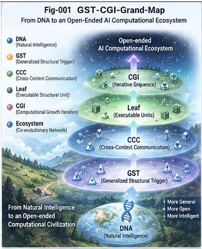

# Generalized Structural Trigger and Computational Growth Intelligence

## From Two-Way CCC and Leaf Resolution to Delegated Unfolding and AI Computational-System Growth

**GST-CGI — Generalized Structural Trigger and Computational Growth Intelligence**

---

## 1. Overview

Many intelligent systems are designed around a relatively fixed computational assumption:

```text
Input
  ↓
Model / Algorithm
  ↓
Reasoning
  ↓
Decision
```

The system may learn new data, accumulate experience, improve scores, or update model parameters.

But the computational structure through which intelligence is performed often remains largely predetermined.

GST-CGI explores a broader question:

> **Can AI grow not only its experience and performance, but also the computational structures and computational systems through which future intelligence is performed?**

The framework begins with a small architectural observation:

> **A Two-Way CCC trigger does not have to be String DNA.**

String DNA is an efficient and useful structural encoding.

But it is only one possible trigger representation.

A trigger may instead be a:

```text
Sequence

Trajectory

Graph

Metric Object

CallingGraph

Context-Bound Object

Policy Object

Event Structure

Domain Expert Object

Behavior-Capable Structural Object
```

This leads to the concept of the:

# Generalized Structural Trigger

A Generalized Structural Trigger may contain:

```text
Structural State
+
Comparison Semantics
+
Controlled Behavior
+
Evidence APIs
+
Policy Perspective
```

Once these capabilities are attached to structural nodes, the consequences extend far beyond trigger representation.

They lead naturally toward:

```text
Generalized Structural Trigger
        ↓
Two-Way CCC
        ↓
Structural Localization
        ↓
Leaf
        ↓
Leaf Resolution Gate
        ↓
DECIDE / REFINE / LEFTOVER / DELEGATE
        ↓
Delta Intelligence / Leaf Sandbox Package
        ↓
Structural Growth
        ↓
Computational Growth
        ↓
Computational-System Growth
        ↓
AI Computational Ecosystem
```

This repository develops that path.

---

# 2. The Core Proposition

The central proposition of GST-CGI is:

> **AI intelligence can grow by changing not only what the system knows, but also the computational structures through which future intelligence is executed.**

This suggests a progression:

```text
Experience Growth
        ↓
Performance / Score Growth
        ↓
Computational-Structure Growth
        ↓
Computational-System Growth
```

At the highest level:

> **AI no longer merely learns within a computational system; it progressively participates in growing the computational system itself.**

---



---

# 3. Why Generalize the Trigger?

Earlier Two-Way CCC demonstrations often use String DNA because it provides:

```text
compact representation

fast comparison

stable dispatch

easy indexing

direct-leaf jumping

simple runtime implementation
```

These remain important advantages.

But an implementation convenience should not become a conceptual restriction.

The key distinction is:

> **DNA is one encoding of a CCC trigger, not the definition of a CCC trigger.**

A more general trigger may expose structural comparability through:

```text
distance

similarity

match

compatibility

containment

dominance

conflict

applicability

evidence
```

Therefore:

```text
String DNA
    ⊂
Encoded Trigger
    ⊂
Generalized Structural Trigger
```

The application envelope of Two-Way CCC expands accordingly.

---

# 4. Generalized Structural Trigger

A canonical GST can be represented as:

```text
GST = <S, C, B, E, P>
```

where:

```text
S = Structural State

C = Comparison / Metric Semantics

B = Controlled Behavior

E = Evidence APIs

P = Policy / Perspective
```

A growth-aware form may additionally expose:

```text
L = Leftover / Delta Interface
```

giving:

```text
GST+ = <S, C, B, E, P, L>
```

This transforms the trigger from a passive lookup key into a local structural-intelligence object.

---

# 5. Three Trigger Levels

GST-CGI distinguishes three useful trigger levels.

## Level 1 — Passive Trigger

Examples:

```text
String DNA

Number

Enum

Tuple

Vector
```

The trigger primarily carries representation.

---

## Level 2 — Structural Trigger

Examples:

```text
Sequence CCC

Trajectory CCC

CallingGraph

Metric CCC

Context-Bound Structural Object
```

The trigger carries richer structural semantics.

---

## Level 3 — Behavioral Trigger

A Behavioral Trigger may contain:

```text
Structural State

Comparison Logic

Domain Behavior

Evidence Evaluation

Counter-Evidence Search

Dispatch Semantics
```

At this point the trigger begins to behave like a small local intelligence unit.

---

# 6. User Plugin Boundary

Generalized triggers create a natural domain-extension boundary.

A domain expert may provide a plugin containing:

```text
State Extraction

Comparison

Metric

Evidence APIs

Counter-Evidence APIs

Controlled Behavior

Candidate Delta
```

But the plugin should not automatically control:

```text
Global Policy

Structural Promotion

Global Memory

Action Authority

Delegation Authority
```

The governing principle is:

> **Plugin supplies domain intelligence; Runtime retains structural authority.**

This makes domain expertise extensible without turning the plugin into an opaque replacement for the structural runtime.

---

# 7. Evidence Is a First-Class Runtime Object

A trigger should not merely say:

```text
MATCH
```

or:

```text
NO MATCH
```

A stronger runtime can expose:

```text
Supporting Evidence

Counter-Evidence

Applicability

Uncertainty

Provenance

Trace
```

This is particularly important when User Plugins participate in structural discrimination.

The runtime should be able to ask:

```text
What state was compared?

Which metric was used?

Which evidence supported the branch?

What counter-evidence existed?

Which policy perspective was active?

Why was A selected instead of B?
```

Evidence therefore becomes part of the structural contract.

---

# 8. Policy Is More Than an Action Filter

Policy is often treated as a final gate:

```text
Decision
   ↓
Policy
   ↓
Action
```

GST-CGI gives policy a deeper role.

Conceptually:

```text
Trigger View
=
f(
    Object,
    Perspective,
    Policy,
    Context
)
```

The same object may be interpreted from:

```text
Performance

Safety

Cost

Temporal

Medical

Counter-Evidence
```

perspectives.

Policy may therefore influence:

```text
Projection

Metric

Evidence Requirements

CCC Selection

Leaf Resolution

Delegation

Action Authority
```

A canonical principle is:

> **DNA may compress the trigger representation, but Policy determines the runtime interpretation space of that representation.**

---

# 9. Two-Way CCC with Generalized Triggers

Two-Way CCC can now be interpreted more generally as:

> **A composable structural discriminator driven by a sufficiently comparable, evidence-bearing, policy-governed structural trigger.**

Conceptually:

```text
              Trigger T
                  |
                  v
           Structural Difference
             /             \
            /               \
           A                 B
```

The important object is not the String key.

It is the structural difference.

---

# 10. Metric Differential Tree and Two-Way CCC

GST-CGI separates two complementary structural functions.

## Metric Differential Tree

asks:

> **Where should this object be localized?**

It defines a:

```text
Structural Localization Space
```

## Two-Way CCC

asks:

> **Which decision-relevant structural difference should discriminate here?**

It defines a:

```text
Structural Discrimination / Dispatch Space
```

Together:

```text
Raw Object
    ↓
GST
    ↓
Metric Representation
    ↓
Metric Differential Tree
    ↓
Structural Region
    ↓
Two-Way CCC
    ↓
Leaf
```

---

# 11. A Leaf Is Not Necessarily a Decision

Reaching a structural leaf does not automatically justify a final decision.

This leads to one of the central principles of GST-CGI:

> **A structural leaf is not necessarily a decision leaf.**

A leaf means:

```text
Current mature structural
discrimination has completed.
```

It does not necessarily mean:

```text
The requested decision has
sufficient evidence.
```

Therefore a separate runtime checkpoint is required.

---

# 12. Leaf Resolution Gate

The **Leaf Resolution Gate — LRG** evaluates whether the current leaf is sufficient under:

```text
Evidence

Counter-Evidence

Uncertainty

Risk

Policy

Decision Cost

Refinement Cost

Available Structure

Delegation Capability
```

The LRG produces four canonical outcomes:

```text
DECIDE

REFINE

LEFTOVER

DELEGATE
```

---

# 13. DECIDE

```text
DECIDE
```

means:

> Current localization and evidence are sufficient for the requested decision under the active policy.

The resulting decision may still be:

```text
Recommendation
```

rather than:

```text
Autonomous Action
```

depending on policy.

---

# 14. REFINE

```text
REFINE
```

means:

> The current leaf is insufficient, but a useful deeper structural differentiation path already exists.

A leaf may therefore become the root of another local CCC:

```text
Leaf
 |
 v
New Local Difference
 /               \
A                 B
```

This is structural unfolding.

---

# 15. LEFTOVER

```text
LEFTOVER
```

means:

> The current mature structure cannot responsibly resolve the case and no sufficiently mature continuation path is available.

Leftover is not an error bucket.

It is an explicit representation of the current structural boundary.

Therefore:

> **Every governed structural discriminator should have explicit Leftover semantics.**

---

# 16. REFINE vs LEFTOVER

The distinction is important.

```text
REFINE
=
Known need
+
Available structural path
```

while:

```text
LEFTOVER
=
Unresolved need
+
Insufficient mature structural support
```

REFINE continues known structure.

LEFTOVER creates an input for structural discovery.

---

# 17. Leftover and Delta Intelligence

Once Leftover becomes explicit, unresolved cases can be accumulated and compared.

The structural-growth loop becomes:

```text
LEFTOVER
    ↓
Collect
    ↓
Compare
    ↓
Cluster
    ↓
Candidate Difference
    ↓
Evidence
    ↓
Counter-Evidence
    ↓
A/B Validation
    ↓
Policy Gate
    ↓
Promotion
    ↓
New Structure
```

This leads to another central principle:

> **Once Leftover becomes a first-class runtime outcome, Delta Intelligence becomes a first-class runtime obligation.**

---

# 18. What Is a Structural Delta?

A Structural Delta is not merely:

```text
something different
```

It is a candidate difference that may justify changing future computation.

A useful Delta should be sufficiently:

```text
Stable

Decision-Relevant

Evidence-Bearing

Discriminative

Policy-Compatible

Reusable

Cost-Justified
```

A validated Delta may produce:

```text
New Branch

New CCC

New Trigger State

New Comparator

New Metric

New Evidence API

New Policy Perspective

New Delegation Path
```

---

# 19. Structural Growth

Structural Growth occurs when a validated Delta changes the machinery through which future cases are processed.

A canonical definition is:

> **Structural Growth is a validated change to the computational machinery through which future cases are localized, discriminated, resolved, or delegated.**

For example:

### Before

```text
Existing CCC
   /     \
  A       B
          |
         Leaf
```

### After

```text
Existing CCC
   /     \
  A       B
          |
          v
     New Difference
       /       \
      C         D
```

Future computation has changed.

---

# 20. DELEGATE

The fourth LRG outcome is:

```text
DELEGATE
```

This means:

> The current leaf is decision-insufficient, but it contains enough useful structural context to support a bounded external computation.

This leads to the:

# Leaf Sandbox Package

---

# 21. Leaf Sandbox Package

A **Leaf Sandbox Package — LSP** is:

> **A policy-bounded executable structural intelligence package generated from a localized leaf.**

Conceptually:

```text
LSP = <C, T, E, B, P, K, R>
```

where:

```text
C = Structural Context

T = Generalized Structural Trigger

E = Evidence Bundle

B = Permitted Behavior

P = Policy Projection

K = Capability Boundary

R = Runtime Contract
```

A richer package may additionally include:

```text
Identity

Provenance

Expiration

Resource Quota

Audit Contract
```

---

# 22. Internal Leaf ≠ Exported LSP

The runtime should not export an internal leaf directly.

Instead:

```text
Internal Leaf
     ↓
Policy Projection
     ↓
Context Reduction
     ↓
Capability Reduction
     ↓
Evidence Packaging
     ↓
Resource Bounding
     ↓
LSP
```

Therefore:

> **LSP is a policy-derived projection of an internal leaf, not a raw serialization of that leaf.**

---

# 23. Export Capability, Not Authority

The external caller may be allowed to:

```text
Compare

Simulate

Search

Generate Tests

Evaluate Evidence

Search Counter-Evidence

Propose Delta
```

but not necessarily:

```text
Modify Global CCC

Promote Structure

Override Policy

Access Unrelated Nodes

Mutate Shared Memory

Expand Its Own Capability
```

The governing principle is:

> **Export capability, not authority.**

---

# 24. Delegated Structural Unfolding

The external AI receives the LSP and continues task-specific computation.

This process is:

# Delegated Structural Unfolding — DSU

The external system may return:

```text
Result

Supporting Evidence

Counter-Evidence

Uncertainty

Candidate Delta

Trace
```

The parent runtime then validates those outputs.

---

# 25. Result ≠ Delta

A crucial distinction is:

```text
Result
=
Current-task output
```

while:

```text
Delta
=
Candidate improvement
to future computation
```

An external Result may be valid even when its proposed Delta is rejected.

Likewise:

> **DELEGATE does not imply PROMOTE.**

---

# 26. External Delta Requires Validation

The canonical return path is:

```text
External AI
    ↓
Result + Evidence + Delta
    ↓
Parent Runtime
    ↓
Result Validation
    +
Delta Validation
```

The Delta must pass:

```text
Evidence

Counter-Evidence

Historical Validation

Decision Relevance

Policy

Promotion Rules
```

before becoming mature structure.

Thus:

> **External Delta is a proposal until locally validated and policy-governed promotion occurs.**

---

# 27. From Answer-as-a-Service to Structural Computation

Traditional AI service:

```text
Request
   ↓
AI
   ↓
Answer
```

GST-CGI introduces another possibility:

```text
Localized Structure
        ↓
Policy-Bounded Package
        ↓
External Intelligence
        ↓
Further Computation
```

The AI provides not merely an answer.

It can provide a bounded computational world.

This suggests:

```text
Answer-as-a-Service
        ↓
Structure-as-a-Service
        ↓
Structural-Intelligence-as-a-Service
```

---

# 28. AI Serving AI

The LSP caller may be:

```text
Human Application

AI Agent

LLM

Specialist Model

Coding AI

Robot Controller

Scientific AI

Another Structural Runtime
```

This opens a broader architecture:

```text
AI-A
 |
 | LSP
 v
AI-B
 |
 | Result
 | Evidence
 | Delta
 v
AI-A
```

The unit of AI-to-AI exchange becomes richer than a prompt.

---

# 29. AI-to-AI Structural Computation Exchange

A canonical exchange is:

```text
AI-A
 |
 | Structure
 | Evidence
 | Capability
 | Policy
 v
AI-B
 |
 | Result
 | Evidence
 | Counter-Evidence
 | Delta
 v
AI-A
```

This can be understood through six primary exchange objects:

```text
STRUCTURE

EVIDENCE

CAPABILITY

POLICY

RESULT

DELTA
```

---

# 30. Structural Sovereignty

AI-B may discover useful differences.

But AI-B should not automatically modify AI-A's mature structural memory.

Therefore:

```text
AI-B
=
Discovery / Computation
```

while:

```text
AI-A
=
Local Validation
+
Policy
+
Promotion Authority
```

unless policy explicitly defines another authority model.

This supports cooperation without unrestricted shared mutable memory.

---

# 31. Structural Collective Learning

Multiple AIs may specialize:

```text
AI-A
=
Structural Localization

AI-B
=
Runtime Verification

AI-C
=
Counter-Evidence Search

AI-D
=
Domain Specialist
```

Together they may produce:

```text
Candidate Difference
        ↓
Evidence
        ↓
Counter-Evidence
        ↓
Generalization
        ↓
Validated Structure
```

This creates a form of:

# Structural Collective Learning

The systems need not merge into one model.

They can exchange bounded computational structures and evidence.

---

# 32. Computational Relationships Can Also Grow

Suppose repeated cases establish that:

```text
Transactional Uncertainty
        ↓
Runtime Verification AI
```

is a reliable computational path.

The relationship itself may become validated structure:

```text
AI-A
 |
 | Certified Delegation Edge
 v
AI-B
```

Now intelligence has grown not only:

```text
inside AI-A
```

but also:

```text
between AI-A and AI-B
```

This is a transition from Computational-Structure Growth to Computational-System Growth.

---

# 33. AI Computational CallingGraph

A mature ecosystem may contain:

```text
Structural AI
      |
      +------> Runtime Verification AI
      |
      +------> Counter-Evidence AI
      |
      +------> Scientific Specialist
      |
      +------> Coding Specialist
```

with each edge carrying:

```text
Policy

Capability

Evidence Contract

Cost

Risk

Provenance

Audit
```

The resulting graph can be viewed as an:

# AI Computational CallingGraph

The organization of computation itself becomes part of the intelligence.

---

# 34. Computational Growth Intelligence

GST-CGI defines:

> **Computational Growth Intelligence as the capability of an intelligent system to construct, refine, validate, delegate, compose, and govern the computational structures through which future intelligence is performed.**

This differs from several related capabilities.

---

# 35. Learning vs Computational Growth

```text
Learning
=
Change knowledge or model state
```

while:

```text
Computational Growth
=
Change the structure
through which future computation occurs
```

Both are important.

They are not identical.

---

# 36. Optimization vs Computational Growth

```text
Optimization
=
Improve an objective
within some search or computational space
```

while:

```text
Computational Growth
=
Potentially modify
the computational space itself
```

A score can improve while computational anatomy remains unchanged.

---

# 37. Reasoning vs Computational Growth

```text
Reasoning
=
Compute through available structure
```

while:

```text
Computational Growth
=
Change available structure
for future reasoning
```

Reasoning unfolds computation.

Growth changes what future unfolding can use.

---

# 38. AI Growth Ladder

GST-CGI proposes four major growth objects.

## Level 1 — Experience Growth

```text
Data

Cases

Memory

Patterns

Trajectories

CCC Experience
```

Question:

> What has the system experienced?

---

## Level 2 — Performance / Score Growth

```text
Evaluation

Selection

Optimization

Better Policy

Better Model

Higher Score
```

Question:

> Can the system perform better?

---

## Level 3 — Computational-Structure Growth

```text
New Node

New Branch

New Trigger

New Metric

New Evidence Contract

New CallingGraph

New Sandbox

New Delegation Rule
```

Question:

> Can the system change how future computation is performed?

At this level:

> **AI begins to grow its computational anatomy.**

---

## Level 4 — Computational-System Growth

```text
New AI Service

New Delegation Edge

New Structural Protocol

New Computational CallingGraph

New AI-to-AI Relationship

New System-of-Systems Structure
```

Question:

> Can the system change how multiple intelligences organize computation together?

---

# 39. Growth Automation Axis

The Growth Object axis is independent of the automation axis.

Automation may progress through:

```text
Manual
    ↓
Human-Assisted
    ↓
Semi-Automatic
    ↓
Policy-Governed Automatic
    ↓
Policy-Governed Autonomous Growth
```

Therefore a system may have:

```text
high structural growth
+
low automation
```

or:

```text
low structural growth
+
high automation
```

These are different properties.

---

# 40. Target Region

The long-term GST-CGI research target is approximately:

```text
Computational-System Growth
+
Policy-Governed Autonomous Growth
```

This does not mean unrestricted self-modification.

It requires:

```text
Evidence

Counter-Evidence

Policy

Capability Boundaries

Audit

Leftover

Validation

Promotion Rules

Rollback
```

---

# 41. Why Governance Becomes More Important

Higher automation should not imply weaker control.

Instead:

```text
More Automation
      ↓
More Explicit Policy
      ↓
More Evidence
      ↓
Stronger Capability Boundaries
      ↓
More Audit
```

Thus:

> **As Computational Growth becomes more autonomous, the Policy Control Plane becomes more important, not less.**

---

# 42. Human Role Evolution

The human role may evolve through:

### Stage 1

```text
Human builds every structure.
```

### Stage 2

```text
AI proposes structure.
Human approves.
```

### Stage 3

```text
AI discovers and validates
bounded structures.
Human governs promotion policy.
```

### Stage 4

```text
AI ecosystems grow
computational relationships.
Human governs structural evolution.
```

The human increasingly becomes a:

> **Governor of Structural Evolution.**

---

# 43. AI Computational Ecosystem

At the system level, GST-CGI envisions:

```text
                   Policy Control Plane
                          |
                          v
                    Structural AI
                  /       |       \
                 /        |        \
                v         v         v
           Specialist   Evidence   Runtime
              AI          AI       AI
                \         |         /
                 \        |        /
                  v       v       v
                     Validation
                         |
                         v
                  Structural Growth
```

The ecosystem exchanges:

```text
Structure

Evidence

Capability

Policy

Result

Delta
```

rather than merely text messages.

---

# 44. Computational Growth Can Be Fractal

The same structural-growth mechanism may operate at several scales.

```text
Trigger Delta
     ↓
CCC Delta
     ↓
Leaf Delta
     ↓
CallingGraph Delta
     ↓
Delegation Delta
     ↓
AI-Service Delta
     ↓
System Delta
```

At each scale:

```text
Difference
    ↓
Evidence
    ↓
Counter-Evidence
    ↓
Validation
    ↓
Policy
    ↓
Promotion
```

This suggests:

> **Computational growth can be fractal: discover–validate–promote may operate from local trigger differences up to computational-system relationships.**

---

# 45. From Local Leftover to System Leftover

At a local node:

```text
LEFTOVER
```

may mean:

```text
Current structural discriminator
cannot resolve this object.
```

At the ecosystem level:

```text
SYSTEM LEFTOVER
```

may mean:

```text
No existing AI service,
delegation protocol,
or computational path
can responsibly resolve this task.
```

Repeated System Leftovers may reveal a need for:

```text
New Specialist AI

New Delegation Protocol

New Composite Computational Path

New Evidence Service

New Structural Interface
```

System Leftover can therefore drive Computational-System Growth.

---

# 46. Relationship to Structural RSI

Recursive Self-Improvement asks broadly:

> How can an intelligent system improve itself recursively?

GST-CGI develops one concrete structural path:

```text
Experience
    ↓
Difference
    ↓
Evidence
    ↓
Candidate Structure
    ↓
Validation
    ↓
Promotion
    ↓
Changed Future Computation
    ↓
New Experience
```

At larger scale:

```text
AI Structure
    ↓
Delegated Computation
    ↓
External Evidence / Delta
    ↓
Validation
    ↓
New Structure
    ↓
New Computational Relationship
    ↓
Computational-System Growth
```

GST-CGI therefore focuses specifically on the **computational structures that recursive improvement may grow and govern**.

---

# 47. Canonical GST-CGI Architecture

```text
RAW OBJECT / TASK
        |
        v
GENERALIZED STRUCTURAL TRIGGER
        |
        v
POLICY PERSPECTIVE
        |
        v
METRIC / STRUCTURAL LOCALIZATION
        |
        v
TWO-WAY CCC
        |
        v
STRUCTURAL LEAF
        |
        v
LEAF RESOLUTION GATE
        |
   +----+----+---------+---------+
   |         |         |         |
   v         v         v         v
DECIDE    REFINE   LEFTOVER   DELEGATE
                       |          |
                       v          v
                    DELTA        LSP
                       |          |
                       |          v
                       |      EXTERNAL AI
                       |          |
                       |          v
                       |     RESULT + DELTA
                       |          |
                       +-----+----+
                             |
                             v
                         VALIDATION
                             |
                             v
                         POLICY GATE
                             |
                             v
                          PROMOTION
                             |
                             v
                    STRUCTURAL GROWTH
                             |
                             v
                  COMPUTATIONAL GROWTH
                             |
                             v
               COMPUTATIONAL-SYSTEM GROWTH
                             |
                             v
                 AI COMPUTATIONAL ECOSYSTEM
```

---

# 48. Canonical Principles

The GST-CGI framework is summarized by the following principles.

### 1.

> **DNA is one encoding of a CCC trigger, not the definition of a CCC trigger.**

### 2.

> **A Two-Way CCC trigger can be a comparable structural object with controlled executable behavior.**

### 3.

> **Plugin supplies domain intelligence; Runtime retains structural authority.**

### 4.

> **DNA may compress the trigger representation, but Policy determines the runtime interpretation space of that representation.**

### 5.

> **A structural leaf is not necessarily a decision leaf.**

### 6.

> **Further differentiation should be justified by decision relevance, not merely by the existence of additional differences.**

### 7.

> **Leafhood is structural; leaf resolution is policy-relative.**

### 8.

> **Every governed structural discriminator should have explicit Leftover semantics.**

### 9.

> **Once Leftover becomes a first-class runtime outcome, Delta Intelligence becomes a first-class runtime obligation.**

### 10.

> **Export capability, not authority.**

### 11.

> **External Delta is a candidate until validated and promoted by the governed parent runtime.**

### 12.

> **AI can grow not only computational structures, but also the computational system through which multiple intelligences cooperate.**

---

# 49. Repository Structure

```text
Generalized-Structural-Trigger-and-Computational-Growth-Intelligence/
│
├── README.md
├── START-HERE.md
├── CONTENTS.md
├── GLOSSARY.md
├── FIGURE-INDEX.md
├── FUTURE-DIRECTIONS.md
│
├── docs/
│   ├── GST-CGI-001-From-DNA-Trigger-to-Generalized-Structural-Trigger.md
│   ├── GST-CGI-002-Generalized-Structural-Trigger-Evidence-Behavior-and-Policy.md
│   ├── GST-CGI-003-Two-Way-CCC-with-Generalized-Structural-Triggers.md
│   ├── GST-CGI-004-Leaf-Resolution-Decide-Refine-Leftover-or-Delegate.md
│   ├── GST-CGI-005-Leaf-Sandbox-Package-and-Delegated-Structural-Unfolding.md
│   ├── GST-CGI-006-From-Leftover-and-Delta-Intelligence-to-Structural-Growth.md
│   ├── GST-CGI-007-Computational-Growth-Intelligence.md
│   └── GST-CGI-008-From-Computational-Structure-Growth-to-AI-Computational-Ecosystems.md
│
├── cases/
│   ├── CASE-001-Policy-Governed-Generalized-Trigger.md
│   ├── CASE-002-Leaf-Resolution-and-Sandbox-Delegation.md
│   └── CASE-003-AI-to-AI-Structural-Computation-Exchange.md
│
├── figures/
│   ├── Fig-001-GST-CGI-Grand-Map.png
│   ├── Fig-002-DNA-to-Generalized-Structural-Trigger.png
│   ├── Fig-003-Generalized-Trigger-Evidence-Policy-Model.png
│   ├── Fig-004-Two-Way-CCC-and-Leaf-Resolution-Gate.png
│   ├── Fig-005-Leaf-Sandbox-Package-and-Delegated-Unfolding.png
│   ├── Fig-006-Leftover-Delta-and-Structural-Growth-Loop.png
│   ├── Fig-007-AI-Growth-Ladder.png
│   └── Fig-008-AI-Computational-Ecosystem.png
│
├── CHANGELOG.md
├── CITATION.cff
├── .zenodo.json
├── LICENSE
└── GitHub-Release-Notes-v1.0.0.md
```

---

# 50. Core Documents

## GST-CGI-001 — From DNA Trigger to Generalized Structural Trigger

Introduces the central generalization:

```text
String DNA
    ↓
Generalized Structural Trigger
```

and establishes structural comparability as the essential trigger requirement.

---

## GST-CGI-002 — Generalized Structural Trigger: Evidence, Behavior, and Policy

Defines:

```text
GST = <S, C, B, E, P>
```

and develops:

```text
Evidence APIs

Controlled Behavior

Policy Perspective

User Plugin Contract

Explicit Leftover
```

---

## GST-CGI-003 — Two-Way CCC with Generalized Structural Triggers

Generalizes Two-Way CCC from String-DNA dispatch toward:

```text
Evidence-Bearing

Policy-Governed

Composable

Structural Discrimination
```

and separates:

```text
MDT Localization
```

from:

```text
CCC Discrimination
```

---

## GST-CGI-004 — Leaf Resolution: Decide, Refine, Leftover, or Delegate

Introduces the:

```text
Leaf Resolution Gate
```

and establishes:

```text
DECIDE

REFINE

LEFTOVER

DELEGATE
```

as four distinct runtime semantics.

---

## GST-CGI-005 — Leaf Sandbox Package and Delegated Structural Unfolding

Introduces:

```text
Leaf Sandbox Package

Delegated Structural Unfolding

Capability Boundary

Policy Projection
```

and the principle:

> **Export capability, not authority.**

---

## GST-CGI-006 — From Leftover and Delta Intelligence to Structural Growth

Develops:

```text
LEFTOVER
    ↓
Delta
    ↓
Candidate Difference
    ↓
Evidence
    ↓
Validation
    ↓
Promotion
    ↓
New Structure
```

as a concrete structural-growth mechanism.

---

## GST-CGI-007 — Computational Growth Intelligence

Formalizes:

```text
Experience Growth

Performance Growth

Computational-Structure Growth

Computational-System Growth
```

and defines Computational Growth Intelligence.

---

## GST-CGI-008 — From Computational-Structure Growth to AI Computational Ecosystems

Extends growth across AI boundaries through:

```text
Structural Packages

Evidence Exchange

Capability Exchange

Policy

Delta

Validated AI-to-AI Relationships
```

leading toward AI Computational Ecosystems.

---

# 51. Canonical Cases

## CASE-001 — Policy-Governed Generalized Trigger

Demonstrates:

```text
One Structural Object
        ↓
Different Policy Perspectives
        ↓
Different Structural Interpretations
```

using Performance, Safety, and Cost perspectives.

---

## CASE-002 — Leaf Resolution and Sandbox Delegation

Demonstrates the complete runtime path:

```text
Leaf
  ↓
LRG
  ↓
DELEGATE
  ↓
LSP
  ↓
External Specialist
  ↓
Result + Evidence + Delta
  ↓
Parent Validation
```

---

## CASE-003 — AI-to-AI Structural Computation Exchange

Demonstrates:

```text
AI-A
  ↓
LSP
  ↓
AI-B
  ↓
Evidence + Delta
  ↓
AI-A Validation
  ↓
New Structure
  ↓
Validated AI Relationship
  ↓
Computational-System Growth
```

and provides the repository's canonical AI Computational Ecosystem example.

---

# 52. Three Cases, Three Scales

The three demonstrations form a deliberate progression:

```text
CASE-001
Trigger Scale
     ↓
CASE-002
Leaf / Runtime Scale
     ↓
CASE-003
AI / Ecosystem Scale
```

They show how the same structural principles can operate from a single trigger to a multi-AI computational system.

---

# 53. Figures

The repository contains eight canonical figures.

```text
Fig-001
GST-CGI Grand Map

Fig-002
DNA to Generalized Structural Trigger

Fig-003
Generalized Trigger — Evidence — Policy Model

Fig-004
Two-Way CCC and Leaf Resolution Gate

Fig-005
Leaf Sandbox Package and Delegated Unfolding

Fig-006
Leftover, Delta, and Structural Growth Loop

Fig-007
AI Growth Ladder

Fig-008
AI Computational Ecosystem
```

Together they provide a visual path from:

```text
Trigger Generalization
```

to:

```text
AI Computational-System Growth
```

---

# 54. Recommended 10-Minute Reading Path

For a fast introduction:

```text
1. README.md
       ↓
2. GST-CGI-001
       ↓
3. GST-CGI-004
       ↓
4. GST-CGI-007
```

This gives the shortest conceptual path:

```text
Generalized Trigger
      ↓
Leaf Resolution
      ↓
Computational Growth
```

---

# 55. Recommended Engineering Path

For implementation-oriented readers:

```text
GST-CGI-002
      ↓
GST-CGI-003
      ↓
GST-CGI-004
      ↓
GST-CGI-005
      ↓
CASE-001
      ↓
CASE-002
```

This path emphasizes:

```text
Trigger Contract

Evidence API

Policy

CCC Runtime

Leaf Resolution

Sandbox Delegation
```

---

# 56. Recommended Computational-Growth Path

For readers interested in AI growth and structural evolution:

```text
GST-CGI-006
      ↓
GST-CGI-007
      ↓
GST-CGI-008
      ↓
CASE-003
```

This gives the progression:

```text
Leftover
    ↓
Delta
    ↓
Structural Growth
    ↓
Computational Growth
    ↓
AI Ecosystem
```

---

# 57. Research Questions

GST-CGI opens several research directions.

### Generalized Trigger

```text
What is the minimal contract
for a Generalized Structural Trigger?
```

### Evidence

```text
How should supporting evidence,
counter-evidence, uncertainty,
and provenance be represented?
```

### Policy

```text
How should policy select
perspective, projection,
metric, and resolution?
```

### Leaf Resolution

```text
How should Decision Sufficiency
be evaluated?
```

### Leftover

```text
When should an unresolved case
be refined, delegated,
or preserved as Leftover?
```

### Delta Intelligence

```text
When does repeated difference
justify new computational structure?
```

### Delegation

```text
How can an LSP safely export
useful computation without
exporting unrestricted authority?
```

### Computational Growth

```text
How should new structures
be validated, promoted,
monitored, rolled back,
or retired?
```

### AI Ecosystems

```text
How can AI-to-AI computational
relationships themselves
become validated structure?
```

---

# 58. Future Directions

Important future directions include:

```text
Cross-AI LSP Protocol

LSP Serialization

Capability Security

Sandbox Verification

Structural Package Composition

Federated Structural Memory

Automated Delta Promotion

Per-Node Micro Structural Intelligence

Computational-Growth Benchmarks

AI Computational CallingGraphs

Structural Service Discovery

System-Level Leftover

System-Level Delta Intelligence

Policy-Governed Autonomous Growth

GST-CGI and Structural RSI
```

See:

```text
FUTURE-DIRECTIONS.md
```

for the extended roadmap.

---

# 59. Research Position

GST-CGI does not claim that every intelligent task should be converted into Two-Way CCCs, nor that every AI system should autonomously modify its own structure.

The narrower proposition is:

> **When stable, evidence-bearing, decision-relevant differences repeatedly appear, they may be candidates for explicit computational structure rather than requiring repeated reconstruction through expensive reasoning.**

And when computational boundaries are crossed:

> **Useful structure can be delegated without surrendering unrestricted authority.**

This provides a practical path between:

```text
Fixed AI Runtime
```

and:

```text
Unrestricted Self-Modifying AI
```

through:

```text
Evidence

Policy

Validation

Capability Boundaries

Explicit Leftover

Controlled Promotion
```

---

# 60. The Larger Direction

The long-term research direction is not simply:

```text
Build a larger model.
```

Nor merely:

```text
Accumulate more memory.
```

Nor only:

```text
Improve the score.
```

GST-CGI asks whether AI can increasingly participate in building:

```text
the triggers it uses

the differences it recognizes

the evidence contracts it requires

the branches it traverses

the sandboxes it exports

the specialists it invokes

the computational relationships it trusts

the computational systems through which
future intelligence is performed
```

This produces the larger progression:

```text
AI uses computation
        ↓
AI learns within computation
        ↓
AI improves computation
        ↓
AI grows computational structure
        ↓
AI grows computational systems
```

---

# 61. Closing Proposition

The smallest GST-CGI question is:

> **Why must a Two-Way CCC trigger be String DNA?**

The answer is:

> It does not have to be.

Once the trigger is generalized, the structural node can begin to carry:

```text
State

Comparison

Behavior

Evidence

Policy

Leftover

Growth Interface
```

Once the leaf is generalized, it can become:

```text
Decision Point

Refinement Point

Unknown Boundary

Computational Handoff Point
```

Once the handoff is generalized, AI systems can exchange:

```text
Structure

Evidence

Capability

Policy

Result

Delta
```

And once those exchanges themselves become evidence-bearing, validated, and reusable:

```text
Computational Relationships
```

can become part of the learned structure.

The resulting research direction is:

> **From Generalized Structural Triggers to Computational Growth Intelligence.**

And ultimately:

> **From AI that learns inside a computational system to AI that participates in growing the computational system itself.**

---

## Project

**Generalized Structural Trigger and Computational Growth Intelligence — GST-CGI**

### From Two-Way CCC and Leaf Resolution to Delegated Unfolding and AI Computational-System Growth

---

## License

Apache License 2.0.

---

## Citation

Citation metadata is provided in:

```text
CITATION.cff
```

and:

```text
.zenodo.json
```

---

## Repository Navigation

Start with:

```text
START-HERE.md
```

For the complete document map:

```text
CONTENTS.md
```

For terminology:

```text
GLOSSARY.md
```

For visual navigation:

```text
FIGURE-INDEX.md
```

For research extensions:

```text
FUTURE-DIRECTIONS.md
```

---

## Author

Sizhe Tan\
Independent Researcher

GPT-Obot\
AI Research Assistant

2026

DOI: TBD
    
---

## 📚 DBM-SI Series Navigation

See:\
[./docs/DBM-SI-Series-of-gitHub-Repositories/DBM-SI-Series-of-gitHub-Repositories.md](./docs/DBM-SI-Series-of-gitHub-Repositories/DBM-SI-Series-of-gitHub-Repositories.md)

[./docs/DBM-SI-Series-of-gitHub-Repositories/DBM-SI-Structural-Intelligence-Dictionary-(v2).md](./docs/DBM-SI-Series-of-gitHub-Repositories/DBM-SI-Structural-Intelligence-Dictionary-(v2).md)

