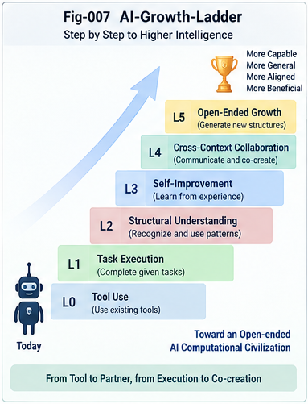

# GST-CGI-007 — Computational Growth Intelligence

## From Growing Experience and Performance to Growing the Structures Through Which Intelligence Computes

**Project:** Generalized Structural Trigger and Computational Growth Intelligence (GST-CGI)
**Subtitle:** From Two-Way CCC and Leaf Resolution to Delegated Unfolding and AI Computational-System Growth
**Document:** GST-CGI-007
**Status:** Research Note / Core Theory
**Version:** 1.0

---

## Abstract

Most discussions of AI improvement focus on changes in knowledge, model parameters, task performance, reasoning quality, or accumulated experience.

These are important forms of growth.

But they leave open a deeper possibility:

> **Can an intelligent system grow the computational structures through which its future intelligence is performed?**

GST-CGI introduces **Computational Growth Intelligence (CGI)** as a distinct capability:

> **Computational Growth Intelligence is the capability of an intelligent system to construct, refine, validate, compose, delegate, promote, and govern the computational structures through which future intelligence is performed.**

This article proposes an **AI Growth Ladder** with four major levels:

```text
Level 4 — Computational-System Growth
Level 3 — Computational-Structure Growth
Level 2 — Performance Growth
Level 1 — Experience Growth
```

These levels answer a fundamental question:

> **What is growing?**

A second, orthogonal axis asks:

> **Who performs the growth?**

Its progression is:

```text
Manual
   ↓
Human-Assisted
   ↓
Semi-Automatic
   ↓
Policy-Governed Automatic
   ↓
Policy-Governed Autonomous Growth
```

The two axes should not be conflated.

A system may automatically accumulate experience while humans manually design its computational structure. Conversely, a system may propose new computational structures while requiring human approval before promotion.

The important frontier appears when these axes intersect:

```text
Computational-Structure / Computational-System Growth
                        ×
          Policy-Governed Autonomous Growth
```

At this frontier, AI begins not merely to learn inside a computational system, but to participate in growing the computational system itself.

GST-CGI provides one concrete structural pathway toward this capability through Generalized Structural Triggers, Two-Way CCC, Leaf Resolution, explicit Leftover, Delta Intelligence, Leaf Sandbox Packages, Delegated Structural Unfolding, evidence validation, and policy-governed structural promotion.

The central proposition is:

> **AI growth can progress from growing what the system remembers, to growing how well it performs, to growing how it computes, and ultimately to growing systems of cooperating computation.**

---

# 1. What Does It Mean for AI to Grow?

The phrase:

```text
AI Growth
```

can refer to very different phenomena.

For example:

```text
more training data

more memories

better benchmark scores

larger models

better reasoning

new tools

new agents

new workflows

new computational structures
```

These are not equivalent.

If they are all described simply as:

```text
AI improves
```

important architectural differences disappear.

GST-CGI therefore begins with a more precise question:

> **What object is actually growing?**

---

# 2. Four Objects of AI Growth

A useful progression is:

```text
Experience
    ↓
Performance
    ↓
Computational Structure
    ↓
Computational System
```

This produces four major growth levels.

---

# 3. Level 1 — Experience Growth

The first level is **Experience Growth**.

The system accumulates:

```text
data

examples

cases

memories

trajectories

events

patterns

traces

evidence

counter-evidence
```

Conceptually:

```text
Experience(t+1)
=
Experience(t)
+
New Experience
```

The system has seen more of the world.

The central question is:

> **What has the system experienced?**

---

# 4. Examples of Experience Growth

Examples include:

```text
adding documents to memory

collecting runtime traces

recording market trajectories

storing user feedback

accumulating failed cases

recording Leftovers

collecting counterexamples

adding new pattern instances
```

Experience Growth can be extremely valuable.

But the computational machinery used to interpret those experiences may remain unchanged.

---

# 5. Experience Growth Does Not Necessarily Change Computation

Suppose:

```text
Runtime v1
```

contains a fixed structural tree.

The system adds:

```text
10 cases
100 cases
1,000 cases
1,000,000 cases
```

but continues to use exactly the same:

```text
Trigger

Comparator

Metric

CCC

Policy

Decision Structure
```

Then the system has experienced more.

But its computational structure has not necessarily grown.

Thus:

> **More experience is not automatically more computational structure.**

---

# 6. Level 2 — Performance Growth

The second level is **Performance Growth**.

Here the system improves according to some measure:

```text
accuracy

reward

latency

cost

robustness

success rate

task score

decision quality
```

The central question becomes:

> **Can the system perform better?**

Conceptually:

```text
Score(t+1) > Score(t)
```

under some evaluation.

---

# 7. Performance Growth Can Occur Without Structural Growth

Suppose a system changes:

```text
threshold 0.70
```

to:

```text
threshold 0.76
```

and accuracy improves.

Or a model is fine-tuned while the external architecture remains unchanged.

Or a search policy is tuned to produce better scores.

The system has improved.

But:

```text
Computational Architecture(t+1)
≈
Computational Architecture(t)
```

Therefore:

> **Performance Growth does not necessarily imply Computational-Structure Growth.**

---

# 8. Score Is Evidence, Not the Whole Meaning of Growth

Scores are extremely useful.

They can help:

```text
compare alternatives

validate changes

select candidates

detect regressions

govern promotion
```

But score alone does not tell us what changed.

Two systems may achieve the same improvement through very different mechanisms:

```text
System A:
better parameter tuning

System B:
new computational structure
```

Therefore GST-CGI treats performance as an important growth dimension, but not the only one.

---

# 9. Level 3 — Computational-Structure Growth

The third level is qualitatively different.

The system changes the structure through which future computation is performed.

Examples include creating or modifying:

```text
Generalized Structural Triggers

comparators

metrics

Two-Way CCCs

branches

evidence APIs

counter-evidence mechanisms

policy perspectives

CallingGraph structures

UTN bindings

local Brain Units

Leaf Resolution policies

sandbox interfaces

delegation capabilities
```

This is **Computational-Structure Growth**.

---

# 10. Definition of Computational-Structure Growth

A useful definition is:

> **Computational-Structure Growth is the creation, refinement, validation, or reorganization of reusable structures that alter how future computation is localized, discriminated, executed, delegated, or governed.**

The key word is:

```text
reusable
```

A one-time computation is not necessarily structural growth.

The new structure must become capable of affecting future computation.

---

# 11. Growing the Computational Anatomy

This level can be described metaphorically as:

> **AI begins to grow its computational anatomy.**

Instead of only acquiring more experiences:

```text
more memory
```

the system may acquire:

```text
a new discriminator

a new branch

a new evidence interface

a new local behavior

a new structural perspective

a new computational handoff
```

The machinery of future intelligence has changed.

---

# 12. Example: New Two-Way CCC

Before growth:

```text
Input
  |
  v
Leaf
  |
  v
LEFTOVER
```

After repeated Delta discovery:

```text
Input
  |
  v
Leaf
  |
  v
New Difference D
     /       \
    A         B
```

The system now possesses a computational distinction that previously did not exist.

Future cases can follow a different path.

That is structural growth.

---

# 13. Example: New Generalized Structural Trigger

Before:

```text
Trigger
=
String DNA
```

After discovering that trajectory behavior matters:

```text
Trigger
=
Trajectory State
+
Temporal Comparator
+
Evidence APIs
+
Behavior
+
Policy Perspective
```

The system has not merely learned another fact.

It has changed what a runtime trigger can compute.

That is computational-structure growth.

---

# 14. Example: New Evidence Capability

Suppose the original runtime checks only:

```text
positive evidence
```

Repeated failures reveal that a mature decision requires:

```text
counter-evidence search
```

The evidence contract evolves:

```text
Evidence API v1
    |
    v
Evidence API v2
    |
    +-- supportingEvidence()
    |
    +-- counterEvidence()
```

The system can now evaluate future structural hypotheses differently.

Again, the computational anatomy has changed.

---

# 15. Level 4 — Computational-System Growth

The fourth level moves beyond an individual computational structure.

A system may begin constructing, composing, delegating to, or coordinating multiple computational structures and intelligent services.

This is **Computational-System Growth**.

The central question becomes:

> **Can AI grow systems of computation rather than only individual computational structures?**

---

# 16. From Structure to System

Consider:

```text
Structural Node A

Structural Node B

Specialist AI C

CallingGraph Service D

Policy Service E
```

These may become:

```text
             Policy
                |
                v
Structural Service A
        |
        v
       LSP
        |
        v
Specialist AI B
        |
        v
Structural Service C
        |
        v
Result + Evidence + Delta
```

The growing object is no longer one branch or one trigger.

It is a computational organization.

---

# 17. Definition of Computational-System Growth

A useful definition is:

> **Computational-System Growth is the creation, composition, specialization, delegation, and governed evolution of multiple computational structures or intelligent components into a larger reusable system of computation.**

This may include:

```text
new structural services

new AI-to-AI delegation paths

new specialist relationships

new computational packages

new policy-controlled compositions

new structural workflows

new local computational ecosystems
```

---

# 18. The AI Growth Ladder

The four levels can now be expressed as:

```text
+--------------------------------------+
| Level 4                              |
| COMPUTATIONAL-SYSTEM GROWTH          |
|                                      |
| Grow systems of computation          |
+--------------------------------------+
                  ↑
+--------------------------------------+
| Level 3                              |
| COMPUTATIONAL-STRUCTURE GROWTH       |
|                                      |
| Grow how AI computes                 |
+--------------------------------------+
                  ↑
+--------------------------------------+
| Level 2                              |
| PERFORMANCE GROWTH                   |
|                                      |
| Grow how well AI performs            |
+--------------------------------------+
                  ↑
+--------------------------------------+
| Level 1                              |
| EXPERIENCE GROWTH                    |
|                                      |
| Grow what AI has experienced         |
+--------------------------------------+
```

This is the canonical **GST-CGI AI Growth Ladder**.

---



---

# 19. Four Questions

Each level answers a different question.

| Growth Level                   | Primary Question                                               |
| ------------------------------ | -------------------------------------------------------------- |
| Experience Growth              | What has the system experienced?                               |
| Performance Growth             | How well can the system perform?                               |
| Computational-Structure Growth | How can the system compute?                                    |
| Computational-System Growth    | How can systems of intelligence organize computation together? |

The distinction is conceptual rather than absolute.

Real systems may grow across several levels simultaneously.

---

# 20. The Levels Are Not Strictly Sequential

The ladder should not be interpreted as:

```text
Level 1 must finish
before Level 2 begins
```

All four may coexist.

For example:

```text
Experience Growth
        +
Performance Optimization
        +
Local Structural Growth
        +
External AI Delegation
```

may occur in the same runtime.

The ladder identifies increasingly powerful **objects of growth**, not rigid chronological phases.

---

# 21. A Second Axis: Who Performs the Growth?

The first axis asks:

> What grows?

A second question is equally important:

> **Who performs the growth?**

This produces the **Growth Automation Axis**.

---

# 22. Growth Automation Axis

A useful progression is:

```text
Manual
   ↓
Human-Assisted
   ↓
Semi-Automatic
   ↓
Policy-Governed Automatic
   ↓
Policy-Governed Autonomous
```

This axis is independent of the AI Growth Ladder.

---

# 23. Level A0 — Manual Growth

Humans perform the growth operation.

For example:

```text
Human observes Leftovers

Human identifies difference

Human designs CCC

Human validates

Human deploys
```

AI may execute the structure, but does not construct it.

---

# 24. Level A1 — Human-Assisted Growth

AI assists the human.

For example:

```text
AI clusters Leftovers

AI finds candidate differences

AI summarizes evidence

AI finds counterexamples

Human designs or approves structure
```

This can dramatically improve expert productivity.

---

# 25. Level A2 — Semi-Automatic Growth

AI performs more of the growth pipeline:

```text
AI discovers Delta

AI generates candidate CCC

AI evaluates evidence

AI runs validation

Human approves promotion
```

The human moves from structure author to structural governor.

---

# 26. Level A3 — Policy-Governed Automatic Growth

The system may automatically promote bounded structures when explicit policy conditions are satisfied.

Example:

```text
Candidate CCC
      |
      v
Evidence Test
      |
      v
Counter-Evidence Test
      |
      v
Regression Test
      |
      v
Risk Test
      |
      v
Policy Gate
      |
      v
Automatic Local Promotion
```

This remains governed automation.

---

# 27. Level A4 — Policy-Governed Autonomous Growth

At a more advanced level, AI may repeatedly perform:

```text
observe

discover

propose

construct

validate

promote

monitor

revise

delegate

compose
```

within explicitly authorized structural boundaries.

This is **Policy-Governed Autonomous Growth**.

The term is intentionally stronger than automation but narrower than unrestricted self-modification.

---

# 28. Why Not Simply Say “Fully Autonomous”?

Because:

```text
Autonomous
```

without qualification can hide the central governance problem.

GST-CGI instead emphasizes:

> **Policy-Governed Autonomous Growth**

because advanced growth should remain bounded by:

```text
Evidence

Counter-Evidence

Policy

Capability Boundaries

Validation

Audit

Versioning

Rollback

Leftover

Promotion Rules
```

Autonomy does not imply unlimited authority.

---

# 29. The Two Axes Are Orthogonal

This is one of the most important distinctions in the framework.

Axis X:

```text
WHAT GROWS?
```

Axis Y:

```text
WHO GROWS IT?
```

They are independent.

For example:

```text
Automatic Experience Growth
```

does not imply:

```text
Automatic Structural Growth
```

Likewise:

```text
Human-designed Structural Growth
```

is still genuine structural growth.

Therefore:

> **Growth object and growth automation must be analyzed separately.**

---

# 30. The Computational Growth Matrix

Conceptually:

|                                    | Manual | Human-Assisted | Semi-Automatic | Policy-Governed Automatic | Policy-Governed Autonomous |
| ---------------------------------- | -----: | -------------: | -------------: | ------------------------: | -------------------------: |
| **Experience Growth**              |      ✓ |              ✓ |              ✓ |                         ✓ |                          ✓ |
| **Performance Growth**             |      ✓ |              ✓ |              ✓ |                         ✓ |                          ✓ |
| **Computational-Structure Growth** |      ✓ |              ✓ |              ✓ |                         ✓ |                   Frontier |
| **Computational-System Growth**    |      ✓ |              ✓ |              ✓ |                  Frontier |                   Frontier |

The exact maturity of any real implementation will vary.

The matrix is intended to identify the research space.

---

# 31. The Important Frontier

The most consequential region is:

```text
Computational-Structure Growth
            +
Computational-System Growth
            ×
Policy-Governed Autonomous Growth
```

Here the AI is no longer merely improving inside a fixed computational environment.

It begins participating in the construction of that environment.

This motivates the central proposition:

> **AI no longer merely learns within a computational system; it progressively participates in growing the computational system itself.**

---

# 32. Computational Growth Intelligence

We can now define the core concept.

> **Computational Growth Intelligence (CGI) is the capability of an intelligent system to construct, refine, validate, compose, delegate, promote, and govern the computational structures through which future intelligence is performed.**

Each verb matters.

---

# 33. Construct

The system may create:

```text
new trigger

new comparator

new CCC

new local branch

new evidence interface

new sandbox package

new computational service
```

---

# 34. Refine

Existing structures may become more precise:

```text
coarse leaf
    ↓
finer local structure
```

or:

```text
simple comparator
    ↓
context-sensitive comparator
```

---

# 35. Validate

Candidate structure must be tested against:

```text
evidence

counter-evidence

historical cases

new cases

performance

risk

policy
```

Without validation, growth becomes uncontrolled structure generation.

---

# 36. Compose

Multiple computational structures may be combined:

```text
CCC-A
  +
CCC-B
  +
CallingGraph
  +
Policy
  ↓
Composite Runtime
```

Composition is central to system-level growth.

---

# 37. Delegate

The runtime may generate:

```text
Leaf Sandbox Package
```

and allow another AI or application to continue computation.

This turns computational structure into a transferable service object.

---

# 38. Promote

A candidate structure becomes part of mature runtime only through a governed promotion process.

```text
Candidate
   ↓
Validation
   ↓
Policy
   ↓
Promotion
   ↓
Mature Structure
```

Promotion converts experimental computation into reusable structural authority.

---

# 39. Govern

The system must determine:

```text
what may grow

where it may grow

who may propose growth

who may validate it

who may promote it

what capabilities it receives

how it is monitored

how it is rolled back
```

Governance is therefore part of Computational Growth Intelligence itself.

---

# 40. CGI vs Learning

Learning broadly means that a system changes based on experience.

Computational Growth is a particular, stronger architectural possibility.

```text
Learning
   |
   +-- may change parameters
   +-- may change memory
   +-- may change representation
   +-- may change policy
```

CGI focuses specifically on:

```text
changing reusable
computational structure
```

through which future intelligence operates.

Therefore:

> **Computational Growth is not a replacement for learning; it identifies a structural form of learning in which the object being grown is the machinery of future computation.**

---

# 41. CGI vs Optimization

Optimization asks:

> Which available configuration produces a better objective?

For example:

```text
minimize loss

maximize reward

reduce latency

increase accuracy
```

CGI asks another question:

> **Should the computational structure itself be extended, reorganized, specialized, or composed?**

Optimization may select within a structure.

Computational Growth may change the structure of the search itself.

---

# 42. CGI vs Reasoning

Reasoning typically computes within some available machinery:

```text
Problem
  |
  v
Reasoning Process
  |
  v
Conclusion
```

Computational Growth may alter that machinery:

```text
Current Reasoning Structure
          |
          v
Observed Delta
          |
          v
New Computational Structure
          |
          v
Future Reasoning
```

Thus:

> **Reasoning computes within structure; Computational Growth can change the structure within which future reasoning occurs.**

---

# 43. CGI vs Memory Growth

Memory growth adds:

```text
what is remembered
```

CGI may change:

```text
how remembered experience
is structurally localized,
compared,
validated,
and reused.
```

Memory is therefore an important input to computational growth but not equivalent to it.

---

# 44. CGI vs Tool Use

Tool use selects an existing external capability.

For example:

```text
Agent
  |
  v
Choose Tool X
```

CGI may generate or reorganize the structural conditions under which tools become relevant:

```text
Input
  |
  v
Structural Localization
  |
  v
New / Existing Computational Structure
  |
  v
Policy
  |
  v
Tool / Agent / LSP
```

Therefore CGI can sit above tool selection.

---

# 45. CGI vs Multi-Agent Systems

A multi-agent architecture usually begins with multiple agents.

CGI does not require that assumption.

It may begin with:

```text
one structural runtime
```

and later grow:

```text
new structural services

new delegated specialists

new computational relationships
```

Thus:

> **Multi-agent organization may be one outcome of Computational-System Growth, but it is not the definition of CGI.**

---

# 46. CGI vs Plugin Architecture

User Plugins are also only one mechanism.

A plugin may provide:

```text
Trigger

Comparator

Evidence API

Behavior
```

But CGI concerns the larger process by which these components become:

```text
localized

validated

composed

governed

promoted

delegated

evolved
```

Therefore:

```text
Plugin Framework
⊂
Possible CGI Mechanisms
```

not:

```text
Plugin Framework
=
CGI
```

---

# 47. CGI and Recursive Self-Improvement

Computational Growth Intelligence also provides a concrete structural interpretation of part of the broader Recursive Self-Improvement problem.

A generic RSI loop may be described as:

```text
AI
 ↓
Improve AI
 ↓
Improved AI
 ↓
Improve Again
```

But this leaves open:

```text
What changes?

How is improvement represented?

How is it validated?

What receives authority?

How is regression prevented?
```

CGI makes one possible path explicit.

---

# 48. Structural RSI Path

A structural RSI pathway may look like:

```text
Runtime Experience
       ↓
Leftover
       ↓
Delta Intelligence
       ↓
Candidate Difference
       ↓
Candidate Computational Structure
       ↓
Evidence + Counter-Evidence
       ↓
Validation
       ↓
Policy-Governed Promotion
       ↓
Improved Runtime Structure
       ↓
New Experience
```

This is recursive improvement through explicit structural growth.

---

# 49. Growth Is Not Automatically Improvement

An important caution follows.

More structure does not necessarily mean better intelligence.

A system can grow:

```text
bad branches

redundant branches

overfit triggers

expensive comparators

conflicting policies

fragile compositions
```

Therefore:

```text
Structural Growth
!=
Structural Improvement
```

CGI requires evaluation and governance.

---

# 50. Growth Quality

A candidate growth event may be evaluated by multiple dimensions:

```text
decision improvement

Leftover reduction

generalization

counter-evidence resistance

runtime cost

latency

structural simplicity

auditability

policy compliance

reversibility
```

A useful growth policy may prefer:

> the smallest validated structural change that produces meaningful reusable computational value.

---

# 51. Structural Growth Has a Cost

Every new structure adds potential cost:

```text
storage

comparison

routing

maintenance

validation

audit

policy complexity

future interaction complexity
```

Therefore uncontrolled structural accumulation may create:

```text
Structural Bloat
```

rather than intelligence.

CGI must include structural economy.

---

# 52. Structural Economy

A mature growth runtime should ask:

```text
Does this difference matter?

Will it be reused?

Does it reduce future computation?

Does it improve decisions?

Does it reduce important Leftover?

Can existing structure express it?

Is a new branch really necessary?
```

Thus:

> **The goal is not maximum structure. It is useful, validated, reusable structure.**

---

# 53. Folding as Computational Compression

Structural growth and folding interact.

Repeated expensive computation may reveal:

```text
stable reusable difference
```

which can be folded into:

```text
CCC

Trigger

Metric

Policy Rule

CallingGraph Constraint
```

Future computation then becomes cheaper.

Conceptually:

```text
Repeated Expensive Reasoning
           ↓
Structural Discovery
           ↓
Validated Difference
           ↓
Folding
           ↓
Reusable Computational Structure
```

This is a form of computational compression.

---

# 54. Unfolding as Structural Reuse

Once folded:

```text
Reusable Structure
       ↓
Localization
       ↓
Unfolding
       ↓
Task-Specific Computation
```

GST-CGI therefore links:

```text
Growth
→ Folding
→ Reuse
→ Unfolding
→ New Experience
→ Growth
```

into a larger cycle.

---

# 55. CGI as a Fold-Grow-Unfold Loop

The complete process may be represented as:

```text
Experience
   |
   v
Structural Difference
   |
   v
Validate
   |
   v
GROW
   |
   v
FOLD
   |
   v
Structural Memory
   |
   v
LOCALIZE
   |
   v
UNFOLD
   |
   v
Compute / Delegate
   |
   v
New Experience
```

This creates a continual computational-growth cycle.

---

# 56. Generalized Structural Trigger as a Growth Unit

GST-CGI began with a small question:

> Why must a Two-Way CCC trigger be String DNA?

The answer eventually exposed a much larger growth mechanism.

A Generalized Structural Trigger may itself contain:

```text
State

Comparison

Evidence

Behavior

Policy Perspective

Leftover Interface
```

Therefore a GST is not merely a routing key.

It can become a local unit of computational capability.

Growing GSTs means growing what local nodes can perceive, compare, justify, and compute.

---

# 57. Two-Way CCC as a Growth Primitive

Two-Way CCC provides:

```text
one explicit difference
```

with:

```text
A
vs
B
```

This makes it suitable for incremental structural growth.

A system can grow:

```text
one validated difference at a time
```

rather than reconstructing its entire intelligence architecture.

This local incrementalism is important for:

```text
validation

audit

rollback

control

scalability
```

---

# 58. Leftover as the Growth Sensor

Leftover tells the system:

> The current computational structure has reached its useful boundary.

Thus Leftover acts like a sensor for missing structure.

```text
Current Structure
      |
      v
Cannot Resolve
      |
      v
LEFTOVER
      |
      v
Potential Growth Signal
```

This is why explicit Leftover is central to CGI.

---

# 59. Delta Intelligence as the Growth Detector

If Leftover is the sensor, Delta Intelligence is the detector.

It asks:

> What new difference would explain the unresolved cases?

Thus:

```text
LEFTOVER
=
Growth Signal Source

DELTA INTELLIGENCE
=
Candidate Difference Discovery

VALIDATION
=
Growth Quality Control

PROMOTION
=
Growth Authority
```

Together they form a structural growth pipeline.

---

# 60. Policy as the Growth Governor

Policy determines:

```text
what may become structure

where it may be installed

which evidence is required

which risk is acceptable

whether human approval is required

whether delegation is permitted

whether rollback is mandatory
```

Therefore:

> **Policy is not merely a decision-time control plane; it is also a growth-time control plane.**

This is essential as automation increases.

---

# 61. LSP as a Computational Reproduction Mechanism

Leaf Sandbox Packages add another dimension.

A mature local structure may generate:

```text
LSP
```

which allows another computational system to reuse that local intelligence.

Conceptually:

```text
Structural Node
      |
      v
Policy Projection
      |
      v
LSP
      |
      v
Another AI
```

The structure has effectively produced a bounded computational descendant.

Not a copy of itself.

Not unrestricted authority.

But a task-specific executable projection.

---

# 62. From Structural Growth to Structural Propagation

This suggests two distinct processes:

```text
Structural Growth
=
create or improve structure
```

and:

```text
Structural Propagation
=
project and distribute useful structure
to other computational systems
```

LSP enables propagation.

Delta Intelligence enables growth.

Together they support larger computational systems.

---

# 63. AI Structures Serving AI

A mature CGI ecosystem may therefore contain:

```text
AI-A
 |
 +-- structural knowledge
 |
 +-- generates LSP-A
          |
          v
         AI-B
          |
          +-- computes
          |
          +-- returns evidence
          |
          +-- proposes Delta
```

The exchange object is no longer merely natural language.

It may be:

```text
Structure

Evidence

Capability

Policy

Delta

Result
```

This is a different form of AI-to-AI collaboration.

---

# 64. Human Role Evolution

As growth automation increases, the human role may evolve.

### Stage 1

```text
Human builds every structure.
```

### Stage 2

```text
AI proposes.
Human constructs / approves.
```

### Stage 3

```text
AI constructs and validates.
Human approves promotion.
```

### Stage 4

```text
AI performs bounded promotion.
Human governs policy.
```

### Stage 5

```text
AI ecosystem grows computational systems
within human-defined governance boundaries.
```

The human moves progressively toward:

> **Governor of Structural Evolution.**

---

# 65. Human Governance Does Not Mean Micromanagement

At high scale, humans cannot manually inspect every branch.

Governance therefore shifts toward defining:

```text
policy

evidence standards

risk boundaries

capability limits

promotion rules

audit requirements

rollback requirements
```

The goal is not:

```text
human approves every computation
```

but:

```text
human governs the space
within which computation and growth
may occur.
```

---

# 66. CGI and the Control Plane

The architecture now naturally separates:

```text
COMPUTATIONAL PLANE

localize
compare
reason
refine
delegate
simulate
```

from:

```text
GROWTH CONTROL PLANE

validate
authorize
promote
version
monitor
demote
rollback
```

This separation can become one of the key engineering patterns of CGI.

---

# 67. The CGI Runtime Stack

A conceptual stack is:

```text
+------------------------------------------+
|        Growth Governance Plane           |
| Policy / Validation / Promotion / Audit |
+------------------------------------------+
|       Computational-System Layer         |
| Composition / Delegation / Services     |
+------------------------------------------+
|      Computational-Structure Layer       |
| GST / CCC / MDT / CG / UTN / LSP        |
+------------------------------------------+
|           Evidence Layer                 |
| Evidence / Counter / Delta / Trace      |
+------------------------------------------+
|          Experience Layer                |
| Cases / Events / Trajectories / Data    |
+------------------------------------------+
```

Growth may propagate upward through these layers.

---

# 68. Computational Growth and Time

CGI also introduces an important temporal distinction.

At time `t`:

```text
Structure(t)
```

determines how the system computes.

Experience between `t` and `t+1` may reveal new deltas.

After governed growth:

```text
Structure(t+1)
!=
Structure(t)
```

Therefore future computation occurs in a different computational world.

This makes intelligence explicitly evolutionary over runtime history.

---

# 69. Growth Trajectory

The AI itself may therefore have a structural trajectory:

```text
S0
 ↓
S1
 ↓
S2
 ↓
S3
 ↓
...
```

where each:

```text
Si
```

represents a version of the computational structure.

The history of these changes becomes a **Computational Growth Trajectory**.

This trajectory may itself become analyzable structural data.

---

# 70. Growth About Growth

Once structural growth trajectories exist, the system may eventually learn:

```text
which kinds of structural changes work

which changes fail

which promotion policies are too aggressive

which domains require more evidence

which structures repeatedly become obsolete
```

This introduces a higher-order possibility:

```text
Intelligence about
how computational growth itself should occur
```

That is a natural bridge toward recursive structural improvement.

---

# 71. CGI Does Not Require Unlimited Self-Modification

None of this requires an AI to possess unrestricted access to its own implementation.

A bounded CGI system may be allowed to grow only:

```text
local CCCs

GST plugins

evidence contracts

sandbox packages

routing structures
```

while being prohibited from modifying:

```text
core security policy

global authority

runtime kernel

promotion rules
```

This makes CGI an incremental engineering concept rather than an all-or-nothing autonomy claim.

---

# 72. Minimal Experimental CGI

A minimal implementation could demonstrate CGI with only:

```text
1. Existing Two-Way CCC

2. Explicit Leftover

3. Leftover Store

4. Delta Detector

5. Candidate A/B Generator

6. Evidence Validator

7. Manual Promotion

8. Updated Runtime Tree
```

That alone would demonstrate:

```text
Experience
   ↓
Delta
   ↓
New Computational Structure
   ↓
Changed Future Runtime
```

No large autonomous architecture is required.

---

# 73. Progressive CGI Roadmap

A practical roadmap could be:

```text
CGI-0
Static Structural Runtime

CGI-1
Explicit Leftover

CGI-2
Delta Discovery

CGI-3
Candidate Structural Generation

CGI-4
Evidence-Based Validation

CGI-5
Human-Governed Promotion

CGI-6
Policy-Governed Automatic Local Growth

CGI-7
Delegated Structural Computation

CGI-8
Computational-System Composition

CGI-9
Policy-Governed Autonomous
Computational-System Growth
```

This provides a gradual experimental path.

---

# 74. The Core CGI Equation

The central idea can be expressed as:

```text
CGI
=
Experience
+
Structural Delta Discovery
+
Candidate Structure Generation
+
Evidence / Counter-Evidence
+
Validation
+
Policy-Governed Promotion
+
Structural Reuse
+
Delegated Composition
```

Or at a higher level:

```text
CGI
=
Intelligence
about
growing the machinery
of future intelligence
```

---

# 75. The Four Growth Statements

The AI Growth Ladder can be summarized in four statements.

> **Experience Growth makes AI remember more.**

> **Performance Growth makes AI perform better.**

> **Computational-Structure Growth changes how AI computes.**

> **Computational-System Growth changes how intelligences organize computation together.**

These four statements provide a compact conceptual map for the entire framework.

---

# 76. Canonical CGI Principles

## Principle 1 — Identify the Growth Object

> **AI improvement should distinguish what is actually growing: experience, performance, computational structure, or computational system.**

---

## Principle 2 — Experience Is Not Structure

> **Accumulating more cases does not necessarily change the machinery used to interpret them.**

---

## Principle 3 — Performance Is Not Structure

> **A higher score does not necessarily imply a new computational structure.**

---

## Principle 4 — Structural Growth Changes Future Computation

> **Computational-Structure Growth changes reusable machinery through which future intelligence is performed.**

---

## Principle 5 — System Growth Composes Intelligence

> **Computational-System Growth changes how multiple computational structures or intelligent components cooperate.**

---

## Principle 6 — Growth Object and Growth Automation Are Orthogonal

> **What grows and who performs the growth are separate architectural dimensions.**

---

## Principle 7 — Autonomous Growth Requires Governance

> **As growth automation increases, evidence, policy, validation, capability boundaries, audit, and rollback become more important rather than less important.**

---

## Principle 8 — Growth Is Not Automatically Improvement

> **New structure must earn promotion through evidence and validation.**

---

## Principle 9 — Prefer Useful Structure Over Maximum Structure

> **Computational Growth Intelligence should optimize for validated reusable computational value, not uncontrolled structural accumulation.**

---

## Principle 10 — Intelligence Can Grow Its Computational Environment

> **An AI system may progress from learning within a computational system toward participating in the governed growth of the computational system itself.**

---

# 77. Canonical GST-CGI Growth Map

The complete framework can now be summarized:

```text
                         EXPERIENCE
                             |
                             v
                    Experience Growth
                             |
                             v
                         Evidence
                             |
                             v
                     Runtime Search
                             |
                             v
                 Generalized Structural Trigger
                             |
                             v
                       Two-Way CCC
                             |
                             v
                           Leaf
                             |
                             v
                   Leaf Resolution Gate
                             |
          +------------------+------------------+
          |                  |                  |
          v                  v                  v
       REFINE             LEFTOVER          DELEGATE
          |                  |                  |
          |                  v                  v
          |          Delta Intelligence        LSP
          |                  |                  |
          |                  v                  v
          |          Candidate Difference   External AI
          |                  |                  |
          |                  v                  v
          |          Candidate Structure    Result / Delta
          |                  |                  |
          +------------------+------------------+
                             |
                             v
                    Evidence Validation
                             |
                             v
                       Policy Gate
                             |
                             v
                    Structural Promotion
                             |
                             v
              COMPUTATIONAL-STRUCTURE GROWTH
                             |
                             v
                     Composition / LSP
                             |
                             v
               COMPUTATIONAL-SYSTEM GROWTH
```

This is the central computational-growth pathway of GST-CGI.

---

# 78. From Growth Intelligence to AI Ecosystem

Once computational structures can:

```text
grow

generate bounded descendants

delegate computation

exchange evidence

return deltas

compose with other structures
```

the next object of study is no longer only one intelligent runtime.

It becomes an ecosystem.

The exchange may look like:

```text
AI-A
 |
 +-- Structure
 +-- Evidence
 +-- Policy
 +-- Capability
 |
 v
AI-B
 |
 +-- Result
 +-- Counter-Evidence
 +-- Delta
 |
 v
AI-C
```

The question becomes:

> **How can growing computational structures form larger policy-governed AI computational systems without collapsing into unrestricted agent interaction or uncontrolled structural mutation?**

That is the subject of the next article.

---

# 79. Conclusion

AI growth is often discussed as if it were a single process.

It is not.

A system may grow its:

```text
experience
```

then its:

```text
performance
```

then its:

```text
computational structure
```

and eventually its:

```text
computational system
```

These form the GST-CGI AI Growth Ladder:

```text
Experience Growth
       ↓
Performance Growth
       ↓
Computational-Structure Growth
       ↓
Computational-System Growth
```

A second independent dimension describes how growth occurs:

```text
Manual
       ↓
Human-Assisted
       ↓
Semi-Automatic
       ↓
Policy-Governed Automatic
       ↓
Policy-Governed Autonomous Growth
```

The important frontier lies where these dimensions meet.

At that frontier:

> **AI no longer merely learns within a computational system; it progressively participates in growing the computational system itself.**

GST-CGI calls the capability enabling this transition:

# Computational Growth Intelligence

Formally:

> **Computational Growth Intelligence is the capability of an intelligent system to construct, refine, validate, compose, delegate, promote, and govern the computational structures through which future intelligence is performed.**

This is not simply learning.

It is not simply optimization.

It is not simply reasoning.

It is not simply tool use.

And it is not equivalent to unrestricted self-modification.

It is a policy-governed process through which experience can produce validated changes to the machinery of future computation.

The path developed by GST-CGI is:

```text
Generalized Structural Trigger
        ↓
Two-Way CCC
        ↓
Structural Localization
        ↓
Leaf Resolution
        ↓
Leftover / Delegate
        ↓
Delta / External Computation
        ↓
Evidence Validation
        ↓
Policy-Governed Promotion
        ↓
Computational-Structure Growth
        ↓
Computational-System Growth
```

The final step opens the largest question of this DOI:

> **What happens when computational structures no longer grow only inside one AI runtime, but begin to serve, compose with, and grow systems of other computational structures and intelligences?**

That is the subject of:

**GST-CGI-008 — From Computational-Structure Growth to AI Computational Ecosystems.**

---

## Project Reading Path

```text
GST-CGI-001
From DNA Trigger to
Generalized Structural Trigger
        |
        v
GST-CGI-002
Generalized Structural Trigger:
Evidence, Behavior, and Policy
        |
        v
GST-CGI-003
Two-Way CCC with
Generalized Structural Triggers
        |
        v
GST-CGI-004
Leaf Resolution:
Decide, Refine, Leftover, or Delegate
        |
        v
GST-CGI-005
Leaf Sandbox Package and
Delegated Structural Unfolding
        |
        v
GST-CGI-006
From Leftover and Delta Intelligence
to Structural Growth
        |
        v
GST-CGI-007
Computational Growth Intelligence
        |
        v
GST-CGI-008
From Computational-Structure Growth
to AI Computational Ecosystems
```

---

**GST-CGI — Generalized Structural Trigger and Computational Growth Intelligence**

**From Two-Way CCC and Leaf Resolution to Delegated Unfolding and AI Computational-System Growth**
